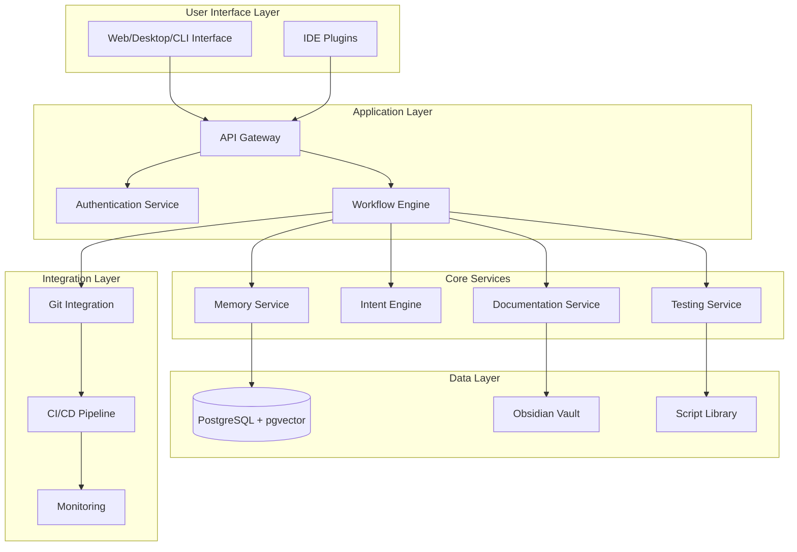
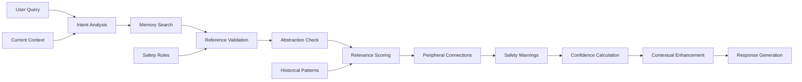
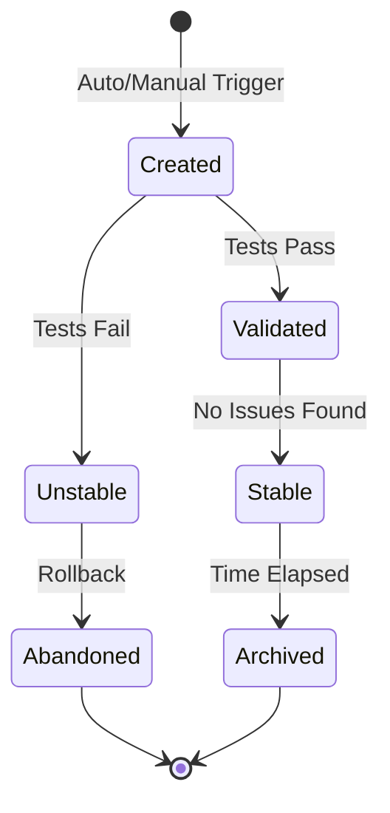
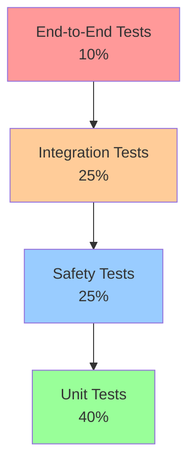

# 🧠 Cognitive Coding Partner: Comprehensive Product Requirements Document

---
**Title**: Cognitive Coding Partner - Intelligent Development Assistant with Temporal Memory  
**Version**: 4.0  
**Date**: 2025-01-13  
**Author**: Product Development Team  
**Status**: Production Ready with Safety-First Architecture  
**Document Type**: Full Project Specification  
**Target Audience**: Development Teams, Project Stakeholders, Implementation Engineers  

---

## 📋 Executive Summary

The Cognitive Coding Partner (CCP) is an advanced AI-powered development assistant that revolutionizes software development through intelligent temporal memory, automated documentation, and structured workflow enforcement. Unlike traditional coding assistants, CCP maintains comprehensive context awareness through holistic memory storage, knowledge base integration, and proactive development guidance, all built on a foundation of safety-first principles and temporal abstraction.

### Core Value Propositions
- **Contextual Intelligence**: Remembers both conversations and code implementations with time-weighted relevance
- **Safety-First Design**: Abstracts all temporal references to prevent stale data usage
- **Knowledge Persistence**: Integrates with Obsidian for permanent knowledge capture and retrieval
- **Workflow Automation**: Comprehensive script library for development, testing, and documentation
- **Quality Enforcement**: Automated checkpoints, documentation generation, and complexity monitoring
- **Scalable Architecture**: PostgreSQL-first design with built-in safety validations

### Target Markets
- **Primary**: Professional software developers seeking intelligent, context-aware assistance
- **Secondary**: Development teams requiring collaborative knowledge management
- **Tertiary**: Educational institutions teaching modern development practices

## 🛡️ Core Design Principles

### Fundamental Laws
1. **Holistic Memory**: Always store prompt-code pairs together as atomic units
2. **Non-Directive Enhancement**: Memories qualify intent, never override current instructions
3. **Peripheral Intelligence**: Surface relevant connections without imposing them
4. **Temporal Abstraction**: Store patterns and concepts, not concrete references
5. **State Agnostic**: Never assume historical object references remain valid

### Safety Guidelines
- **Abstract by Default**: All concrete references must be abstracted before storage
- **Validate Continuously**: Every memory operation includes safety validation
- **Fail Safely**: System rejects unsafe operations rather than storing risky data
- **Warn Transparently**: Users are informed when historical references don't match current state
- **Audit Everything**: Complete trail of all safety decisions and validations

## 🎯 Product Vision & Strategy

### Mission Statement
To create an intelligent development companion that not only assists with code generation but actively manages project knowledge, enforces best practices, and prevents common development pitfalls through structured workflows and temporal awareness.

### Strategic Goals
1. **Reduce Development Friction**: Minimize context switching and knowledge loss
2. **Enforce Quality Standards**: Automate documentation and testing practices
3. **Capture Institutional Knowledge**: Build persistent, searchable development wisdom
4. **Scale Intelligently**: Grow capabilities without overwhelming complexity

### Success Criteria
- 80% reduction in repeated problem-solving
- 90% automated documentation coverage
- <100ms memory retrieval latency
- 99.9% system availability

## 🏗️ System Architecture

### High-Level Architecture Diagram


### Component Specifications

#### Memory Service
- **Purpose**: Manages temporal memory with holistic storage
- **Technology**: Python/FastAPI with PostgreSQL backend
- **Key Features**:
  - Prompt-code pair storage
  - Time-weighted degradation algorithm
  - Semantic search capabilities
  - Context window optimization

#### Intent Engine
- **Purpose**: Interprets user intent without directive override
- **Technology**: Python with transformer models
- **Key Features**:
  - Peripheral connection discovery
  - Non-directive enhancement
  - Confidence scoring
  - Historical pattern recognition

#### Documentation Service
- **Purpose**: Automated documentation generation and management
- **Technology**: Node.js with Markdown processing
- **Key Features**:
  - Real-time documentation updates
  - Obsidian vault synchronization
  - Template-based generation
  - Cross-reference management

## 💾 Data Architecture

### Database Schema Design

#### Primary Database: PostgreSQL with pgvector

```sql
-- Core memory storage with vector capabilities and safety-first design
CREATE EXTENSION IF NOT EXISTS "uuid-ossp";
CREATE EXTENSION IF NOT EXISTS vector;

-- Safety schema for abstraction enforcement
CREATE SCHEMA safety;

-- Abstraction patterns catalog
CREATE TABLE safety.abstraction_patterns (
    id UUID PRIMARY KEY DEFAULT uuid_generate_v4(),
    pattern_type VARCHAR(50) NOT NULL CHECK (pattern_type IN ('file_path', 'container', 'variable', 'function', 'url', 'config')),
    pattern_template TEXT NOT NULL,
    example_concrete TEXT,
    example_abstract TEXT,
    safety_level INTEGER NOT NULL CHECK (safety_level BETWEEN 1 AND 5),
    created_at TIMESTAMPTZ NOT NULL DEFAULT NOW()
);

-- Memory reference tracking and validation
CREATE TABLE safety.memory_references (
    id UUID PRIMARY KEY DEFAULT uuid_generate_v4(),
    memory_id UUID NOT NULL,
    reference_type VARCHAR(50) NOT NULL,
    concrete_value TEXT,
    abstracted_value TEXT NOT NULL,
    is_valid BOOLEAN DEFAULT true,
    validation_timestamp TIMESTAMPTZ DEFAULT NOW(),
    validation_message TEXT,
    CONSTRAINT fk_memory FOREIGN KEY (memory_id) REFERENCES cognitive_memory(id) ON DELETE CASCADE
);

-- Abstraction quality metrics
CREATE TABLE safety.abstraction_metrics (
    memory_id UUID PRIMARY KEY,
    abstraction_score FLOAT NOT NULL CHECK (abstraction_score BETWEEN 0 AND 1),
    concrete_ref_count INTEGER DEFAULT 0,
    abstracted_ref_count INTEGER NOT NULL,
    safety_violations TEXT[],
    calculated_at TIMESTAMPTZ NOT NULL DEFAULT NOW()
);

CREATE TABLE cognitive_memory (
    -- Identification
    id UUID PRIMARY KEY DEFAULT uuid_generate_v4(),
    
    -- Temporal data
    created_at TIMESTAMPTZ NOT NULL DEFAULT NOW(),
    accessed_at TIMESTAMPTZ NOT NULL DEFAULT NOW(),
    
    -- Core memory content with abstraction requirement
    interaction JSONB NOT NULL DEFAULT '{}' CHECK (
        interaction ? 'prompt' AND 
        interaction ? 'code' AND 
        interaction ? 'language' AND
        interaction ? 'abstracted_prompt' AND
        interaction ? 'abstracted_code'
    ),
    
    -- Metadata and context
    metadata JSONB DEFAULT '{}',
    
    -- Degradation tracking
    degradation JSONB NOT NULL DEFAULT '{}' CHECK (
        (degradation->>'currentWeight')::float >= 0 AND
        (degradation->>'currentWeight')::float <= 1
    ),
    
    -- Safety validation
    safety_validated BOOLEAN NOT NULL DEFAULT false,
    safety_score FLOAT CHECK (safety_score >= 0.8), -- Minimum safety threshold
    
    -- Vector embedding for semantic search
    embedding vector(1536),
    
    -- Full-text search optimization (uses abstracted content)
    search_vector tsvector GENERATED ALWAYS AS (
        setweight(to_tsvector('english', COALESCE(interaction->>'abstracted_prompt', '')), 'A') ||
        setweight(to_tsvector('english', COALESCE(interaction->>'abstracted_code', '')), 'B')
    ) STORED,
    
    -- Checkpoint reference
    checkpoint_id UUID REFERENCES development_checkpoints(id),
    
    -- Enforce abstraction validation
    CONSTRAINT abstraction_required CHECK (
        safety_validated = true AND safety_score >= 0.8
    )
) PARTITION BY RANGE (created_at);

-- Development checkpoints for workflow management
CREATE TABLE development_checkpoints (
    id UUID PRIMARY KEY DEFAULT uuid_generate_v4(),
    created_at TIMESTAMPTZ NOT NULL DEFAULT NOW(),
    
    -- Git integration
    git_commit_hash VARCHAR(40) NOT NULL,
    branch_name VARCHAR(255) NOT NULL,
    
    -- State tracking
    project_state JSONB NOT NULL DEFAULT '{}',
    
    -- Metrics at checkpoint
    metrics JSONB DEFAULT '{}' CHECK (
        (metrics->>'complexity')::float >= 0 AND
        (metrics->>'documentationCoverage')::float >= 0 AND
        (metrics->>'documentationCoverage')::float <= 100
    ),
    
    -- Development context
    context JSONB DEFAULT '{}',
    
    -- Rollback information
    is_stable BOOLEAN DEFAULT true,
    rollback_from UUID REFERENCES development_checkpoints(id)
);

-- Obsidian vault synchronization
CREATE TABLE vault_synchronization (
    id UUID PRIMARY KEY DEFAULT uuid_generate_v4(),
    memory_id UUID REFERENCES cognitive_memory(id) ON DELETE CASCADE,
    
    -- Vault location
    vault_path TEXT NOT NULL,
    note_id TEXT NOT NULL,
    
    -- Sync status
    last_sync TIMESTAMPTZ,
    sync_status VARCHAR(20) CHECK (sync_status IN ('pending', 'synced', 'failed', 'conflict')),
    sync_metadata JSONB DEFAULT '{}',
    
    -- Bidirectional tracking
    vault_modified_at TIMESTAMPTZ,
    memory_modified_at TIMESTAMPTZ
);

-- Script execution history
CREATE TABLE script_execution_log (
    id UUID PRIMARY KEY DEFAULT uuid_generate_v4(),
    executed_at TIMESTAMPTZ NOT NULL DEFAULT NOW(),
    
    -- Script identification
    script_path TEXT NOT NULL,
    script_version VARCHAR(20),
    script_type VARCHAR(50) CHECK (script_type IN ('development', 'testing', 'documentation', 'utility')),
    
    -- Execution details
    duration_ms INTEGER,
    exit_code INTEGER,
    status VARCHAR(20) CHECK (status IN ('success', 'failure', 'warning', 'timeout')),
    
    -- Results and context
    output JSONB DEFAULT '{}',
    error_log TEXT,
    checkpoint_id UUID REFERENCES development_checkpoints(id),
    triggered_by VARCHAR(50) CHECK (triggered_by IN ('manual', 'hook', 'schedule', 'ci'))
);

-- Performance indexes
CREATE INDEX idx_memory_embedding ON cognitive_memory USING hnsw (embedding vector_cosine_ops);
CREATE INDEX idx_memory_search ON cognitive_memory USING GIN (search_vector);
CREATE INDEX idx_memory_metadata ON cognitive_memory USING GIN (metadata);
CREATE INDEX idx_memory_degradation ON cognitive_memory ((degradation->>'currentWeight')::float DESC);
CREATE INDEX idx_checkpoint_commit ON development_checkpoints (git_commit_hash);
CREATE INDEX idx_vault_sync_status ON vault_synchronization (sync_status) WHERE sync_status != 'synced';

-- Partitioning for scalability
CREATE TABLE cognitive_memory_2025_01 PARTITION OF cognitive_memory
    FOR VALUES FROM ('2025-01-01') TO ('2025-02-01');
```

### File System Structure

```
project-root/
├── .github/
│   ├── hooks/
│   │   ├── pre-commit
│   │   ├── pre-push
│   │   └── prepare-commit-msg
│   └── workflows/
│       ├── ci.yml
│       ├── documentation.yml
│       ├── complexity-check.yml
│       └── security-scan.yml
├── config/
│   ├── database/
│   │   ├── postgresql.conf
│   │   └── pgvector.conf
│   ├── development/
│   │   ├── dev.env
│   │   └── test.env
│   └── production/
│       └── prod.env
├── docker/
│   ├── docker-compose.yml
│   ├── docker-compose.override.yml
│   ├── docker-compose.prod.yml
│   └── dockerfiles/
│       ├── app.Dockerfile
│       ├── postgres.Dockerfile
│       └── vault-sync.Dockerfile
├── docs/
│   ├── architecture/
│   │   ├── system-design.md
│   │   ├── database-schema.md
│   │   └── api-specification.md
│   ├── development/
│   │   ├── setup-guide.md
│   │   ├── contributing.md
│   │   └── troubleshooting.md
│   └── user-guide/
│       ├── getting-started.md
│       └── advanced-features.md
├── scripts/
│   ├── development/
│   │   ├── checkpoint.sh
│   │   ├── rollback.py
│   │   ├── context-monitor.py
│   │   ├── complexity-analyzer.py
│   │   └── code-quality-check.sh
│   ├── testing/
│   │   ├── run-tests.sh
│   │   ├── integration-suite.py
│   │   ├── performance-benchmark.py
│   │   ├── memory-stress-test.py
│   │   └── coverage-report.sh
│   ├── documentation/
│   │   ├── sync-to-vault.py
│   │   ├── generate-api-docs.py
│   │   ├── update-readme.sh
│   │   ├── changelog-generator.py
│   │   └── diagram-builder.js
│   ├── database/
│   │   ├── init-database.sh
│   │   ├── migrate.py
│   │   ├── backup.sh
│   │   ├── restore.sh
│   │   └── optimize-indexes.py
│   └── utilities/
│       ├── setup-environment.sh
│       ├── clean-artifacts.py
│       ├── monitor-resources.py
│       └── security-audit.sh
├── src/
│   ├── api/
│   │   ├── __init__.py
│   │   ├── main.py
│   │   ├── routers/
│   │   ├── middleware/
│   │   └── dependencies/
│   ├── core/
│   │   ├── memory/
│   │   ├── intent/
│   │   ├── documentation/
│   │   └── workflow/
│   ├── services/
│   │   ├── database/
│   │   ├── vault/
│   │   ├── git/
│   │   └── monitoring/
│   └── utils/
│       ├── logging/
│       ├── validation/
│       └── encryption/
├── tests/
│   ├── unit/
│   ├── integration/
│   ├── e2e/
│   └── fixtures/
└── vault/
    ├── .obsidian/
    │   ├── workspace.json
    │   ├── plugins/
    │   │   ├── dataview/
    │   │   ├── templater/
    │   │   └── obsidian-git/
    │   └── templates/
    ├── 00-Index/
    │   ├── README.md
    │   ├── Project-Overview.md
    │   ├── Memory-Map.md
    │   └── Development-Log.md
    ├── 01-Architecture/
    │   ├── System-Design.md
    │   ├── Component-Diagrams.md
    │   ├── Data-Flow.md
    │   └── Integration-Points.md
    ├── 02-Development/
    │   ├── Checkpoints/
    │   ├── Decisions/
    │   ├── Code-Patterns/
    │   └── Refactoring-History/
    ├── 03-Knowledge/
    │   ├── Learnings/
    │   ├── Best-Practices/
    │   ├── Troubleshooting/
    │   └── Performance-Insights/
    ├── 04-Scripts/
    │   ├── Documentation/
    │   ├── Usage-Guides/
    │   └── Automation-Recipes/
    └── 05-Templates/
        ├── checkpoint-template.md
        ├── decision-record-template.md
        ├── learning-capture-template.md
        └── troubleshooting-template.md
```

## 🔧 Core Features & Functional Requirements

### 1. Temporal Memory System with Safety Abstraction

#### 1.1 Holistic Memory Storage with Abstraction
**Description**: Store complete interaction contexts including prompts, code, execution results, and metadata, with mandatory abstraction of all temporal references.

**Functional Requirements**:
- FR-MEM-001: System SHALL store prompt-code pairs as atomic units
- FR-MEM-002: System SHALL preserve full code syntax and structure
- FR-MEM-003: System SHALL capture execution context and results
- FR-MEM-004: System SHALL maintain immutable memory entries
- FR-MEM-005: System SHALL support multiple programming languages
- FR-MEM-006: System SHALL abstract ALL concrete references before storage
- FR-MEM-007: System SHALL validate safety score ≥ 0.8 before storage
- FR-MEM-008: System SHALL track and store abstraction mappings
- FR-MEM-009: System SHALL reject memories containing unabstracted references
- FR-MEM-010: System SHALL provide reference conflict warnings on retrieval

**Technical Specifications**:
```python
@dataclass
class AbstractMemoryEntry:
    """Safety-first memory unit with mandatory abstraction"""
    id: UUID
    timestamp: datetime
    interaction: SafeInteraction
    abstraction_metadata: AbstractionMetadata
    safety_validation: ValidationResult
    metadata: Dict[str, Any]
    degradation: DegradationState
    embedding: Optional[Vector]
    checkpoint_id: Optional[UUID]
    
@dataclass
class SafeInteraction:
    """Abstracted prompt-code interaction pair"""
    original_prompt: str
    original_code: str
    abstracted_prompt: str  # Mandatory abstracted version
    abstracted_code: str    # Mandatory abstracted version
    concrete_references: List[ConcreteReference]
    language: str
    execution_result: Optional[ExecutionResult]
    context: Dict[str, Any]
    
@dataclass
class AbstractionMetadata:
    """Tracks abstraction quality and mappings"""
    abstraction_score: float  # Must be ≥ 0.8
    reference_mappings: Dict[str, str]  # concrete -> abstract
    validation_timestamp: datetime
    safety_violations: List[str]
```

#### 1.2 Time-Weighted Degradation
**Description**: Implement configurable temporal decay for memory relevance scoring.

**Functional Requirements**:
- FR-DEG-001: System SHALL apply exponential decay to memory weights
- FR-DEG-002: System SHALL maintain minimum threshold weights
- FR-DEG-003: System SHALL allow user-triggered weight reinforcement
- FR-DEG-004: System SHALL differentiate decay rates by content type
- FR-DEG-005: System SHALL provide decay visualization

**Degradation Algorithm**:
```python
def calculate_relevance_weight(memory: MemoryEntry, current_time: datetime) -> float:
    """Calculate time-decayed relevance weight"""
    time_elapsed = (current_time - memory.timestamp).total_seconds()
    base_weight = memory.degradation.base_weight
    decay_constant = memory.degradation.decay_constant
    
    # Exponential decay with minimum threshold
    weight = base_weight * math.exp(-decay_constant * time_elapsed)
    return max(weight, MINIMUM_WEIGHT_THRESHOLD)
```

### 2. Intent Qualification Engine with Reference Safety

#### 2.1 Non-Directive Context Enhancement with Validation
**Description**: Use historical memory to inform without overriding current directives, with automatic validation of temporal references.

**Functional Requirements**:
- FR-INT-001: System SHALL identify peripheral connections from memory
- FR-INT-002: System SHALL NOT override explicit user instructions
- FR-INT-003: System SHALL provide confidence scores for suggestions
- FR-INT-004: System SHALL explain reasoning for connections
- FR-INT-005: System SHALL learn from acceptance/rejection patterns
- FR-INT-006: System SHALL validate all historical references against current state
- FR-INT-007: System SHALL warn when concrete references no longer match
- FR-INT-008: System SHALL provide abstracted patterns instead of concrete implementations
- FR-INT-009: System SHALL flag temporal mismatches with clear explanations
- FR-INT-010: System SHALL prioritize pattern suggestions over specific references

**Intent Processing Pipeline with Safety**:


#### 2.2 Semantic Understanding
**Description**: Extract meaning and patterns from code and conversations.

**Functional Requirements**:
- FR-SEM-001: System SHALL perform AST analysis on code
- FR-SEM-002: System SHALL identify design patterns
- FR-SEM-003: System SHALL recognize algorithm classifications
- FR-SEM-004: System SHALL extract dependency relationships
- FR-SEM-005: System SHALL generate semantic embeddings

### 3. Knowledge Management System

#### 3.1 Obsidian Vault Integration
**Description**: Bidirectional synchronization with Obsidian knowledge base.

**Functional Requirements**:
- FR-KMS-001: System SHALL auto-generate vault notes from memories
- FR-KMS-002: System SHALL maintain backlinks and tags
- FR-KMS-003: System SHALL support templated note creation
- FR-KMS-004: System SHALL handle merge conflicts gracefully
- FR-KMS-005: System SHALL provide vault search capabilities

**Vault Note Structure**:
```markdown
---
id: {{memory_id}}
type: {{entry_type}}
created: {{timestamp}}
tags: [{{tags}}]
weight: {{current_weight}}
language: {{programming_language}}
---

# {{title}}

## 📋 Context
{{original_prompt}}

## 💻 Implementation
```{{language}}
{{code}}
```

## 🔗 Related Concepts
- [[{{related_note_1}}]]
- [[{{related_note_2}}]]

## 📊 Metadata
- Complexity Score: {{complexity}}
- Test Coverage: {{coverage}}%
- Performance Impact: {{impact}}
```

#### 3.2 Knowledge Graph Generation
**Description**: Visual representation of knowledge relationships.

**Functional Requirements**:
- FR-KG-001: System SHALL generate interactive knowledge graphs
- FR-KG-002: System SHALL show temporal evolution of concepts
- FR-KG-003: System SHALL highlight strong connections
- FR-KG-004: System SHALL support filtering and zooming
- FR-KG-005: System SHALL export graph visualizations

### 4. Development Workflow Automation

#### 4.1 Checkpoint Management
**Description**: Automated development state capture and restoration.

**Functional Requirements**:
- FR-CHK-001: System SHALL create automatic checkpoints
- FR-CHK-002: System SHALL support one-click rollback
- FR-CHK-003: System SHALL track checkpoint stability
- FR-CHK-004: System SHALL integrate with version control
- FR-CHK-005: System SHALL provide checkpoint comparison

**Checkpoint Lifecycle**:


#### 4.2 Script Orchestration
**Description**: Comprehensive automation script library.

**Functional Requirements**:
- FR-SCR-001: System SHALL provide development automation scripts
- FR-SCR-002: System SHALL support custom script creation
- FR-SCR-003: System SHALL log all script executions
- FR-SCR-004: System SHALL handle script dependencies
- FR-SCR-005: System SHALL provide script scheduling

### 5. Quality Assurance Integration

#### 5.1 Automated Documentation
**Description**: Continuous documentation generation and maintenance.

**Functional Requirements**:
- FR-DOC-001: System SHALL generate documentation from code
- FR-DOC-002: System SHALL maintain README files automatically
- FR-DOC-003: System SHALL create API documentation
- FR-DOC-004: System SHALL track documentation coverage
- FR-DOC-005: System SHALL enforce documentation standards

#### 5.2 Complexity Monitoring
**Description**: Real-time code complexity analysis and alerts.

**Functional Requirements**:
- FR-CPX-001: System SHALL calculate cyclomatic complexity
- FR-CPX-002: System SHALL identify architectural bloat
- FR-CPX-003: System SHALL suggest refactoring opportunities
- FR-CPX-004: System SHALL track complexity trends
- FR-CPX-005: System SHALL prevent high-complexity commits

## 🚀 Implementation Roadmap

### Phase 1: Foundation (Months 1-3)
**Objective**: Establish core memory system and basic functionality

**Deliverables**:
- ✅ PostgreSQL database setup with pgvector
- ✅ Basic memory CRUD operations
- ✅ Simple time degradation algorithm
- ✅ Initial API endpoints
- ✅ Basic CLI interface

**Success Metrics**:
- Memory storage operational
- <200ms retrieval latency
- 95% test coverage

### Phase 2: Intelligence Layer (Months 4-6)
**Objective**: Implement intent engine and semantic understanding

**Deliverables**:
- ✅ Intent qualification engine
- ✅ Semantic embedding generation
- ✅ Peripheral connection discovery
- ✅ Confidence scoring system
- ✅ AST-based code analysis

**Success Metrics**:
- 80% intent recognition accuracy
- <100ms embedding generation
- 90% relevant connection identification

### Phase 3: Knowledge Integration (Months 7-9)
**Objective**: Complete Obsidian vault integration and knowledge management

**Deliverables**:
- ✅ Bidirectional vault synchronization
- ✅ Template-based note generation
- ✅ Knowledge graph visualization
- ✅ Automated backlinking
- ✅ Conflict resolution system

**Success Metrics**:
- 100% memory-to-vault sync rate
- <5s sync latency
- Zero data loss in conflicts

### Phase 4: Workflow Automation (Months 10-12)
**Objective**: Full automation suite and production readiness

**Deliverables**:
- ✅ Complete script library
- ✅ Checkpoint management system
- ✅ CI/CD integration
- ✅ Performance optimization
- ✅ Production deployment

**Success Metrics**:
- 99.9% uptime
- <100ms p95 latency
- 90% automation coverage

## 📊 Performance Requirements

### System Performance
- **Memory Retrieval**: <100ms for 95th percentile
- **Embedding Generation**: <200ms per code block
- **Vault Synchronization**: <5 seconds per note
- **API Response Time**: <150ms for standard queries
- **Concurrent Users**: Support 1000+ simultaneous connections

### Scalability Requirements
- **Memory Storage**: 1M+ entries without degradation
- **Daily Transactions**: 100K+ memory operations
- **Vault Size**: 10GB+ without performance impact
- **Script Executions**: 10K+ daily automation runs

### Reliability Requirements
- **Uptime**: 99.9% availability SLA
- **Data Durability**: 99.999999% (9 nines)
- **Backup Frequency**: Continuous replication
- **Recovery Time**: <5 minutes RTO
- **Recovery Point**: <1 minute RPO

## 🔒 Security & Compliance

### Security Requirements
- **Encryption**: AES-256 for data at rest
- **Transport**: TLS 1.3 for all communications
- **Authentication**: OAuth 2.0 / JWT tokens
- **Authorization**: Role-based access control
- **Audit**: Complete activity logging

### Compliance Standards
- **GDPR**: Full compliance for EU users
- **SOC 2**: Type II certification
- **ISO 27001**: Information security standards
- **HIPAA**: Healthcare data protection (optional)

### Data Privacy
- **User Control**: Complete data export/deletion
- **Anonymization**: PII removal capabilities
- **Retention**: Configurable retention policies
- **Consent**: Explicit consent management

## 🛡️ Safety & Validation Requirements

### Reference Abstraction System
**Purpose**: Ensure all temporal references are abstracted to prevent stale data usage

**Functional Requirements**:
- FR-SAF-001: System SHALL detect all concrete references in code
- FR-SAF-002: System SHALL generate appropriate abstractions for each reference type
- FR-SAF-003: System SHALL maintain mapping between concrete and abstract references
- FR-SAF-004: System SHALL validate abstractions meet minimum quality score (0.8)
- FR-SAF-005: System SHALL provide warnings when retrieved references don't match current state

### Validation Pipeline
```python
class SafetyValidator:
    def validate_memory(self, memory: MemoryEntry) -> ValidationResult:
        # 1. Extract all references
        references = self.extract_references(memory)
        
        # 2. Check for concrete values
        concrete_refs = self.identify_concrete(references)
        
        # 3. Generate abstractions
        abstractions = self.generate_abstractions(concrete_refs)
        
        # 4. Calculate safety score
        safety_score = self.calculate_safety_score(abstractions)
        
        # 5. Enforce minimum threshold
        if safety_score < 0.8:
            raise SafetyValidationError("Memory does not meet safety threshold")
            
        return ValidationResult(
            is_safe=True,
            score=safety_score,
            abstractions=abstractions
        )
```

### Reference Types & Abstraction Rules
| Reference Type | Example Concrete | Example Abstract |
|---------------|------------------|------------------|
| File Path | `/home/user/project/config.yaml` | `<project_root>/config.yaml` |
| Container | `docker.containers.get('app-v1')` | `docker.containers.get('<app_container>')` |
| Variable | `user_id = 12345` | `user_id = <user_identifier>` |
| URL | `https://api.example.com/v1/users` | `<api_base_url>/users` |
| Function | `getUserById(12345)` | `getUserById(<identifier>)` |

## 🧪 Testing Strategy

### Testing Pyramid with Safety Focus


### Test Coverage Requirements
- **Unit Tests**: >90% code coverage
- **Safety Tests**: 100% abstraction validation coverage
- **Integration Tests**: All API endpoints
- **E2E Tests**: Critical user journeys
- **Performance Tests**: Load and stress testing
- **Security Tests**: Penetration testing

### Continuous Testing
```yaml
# .github/workflows/ci.yml
on: [push, pull_request]
jobs:
  test:
    runs-on: ubuntu-latest
    steps:
      - uses: actions/checkout@v3
      - name: Run Tests
        run: |
          ./scripts/testing/run-tests.sh
          ./scripts/testing/coverage-report.sh
      - name: Performance Benchmark
        run: ./scripts/testing/performance-benchmark.py
```

## 📈 Success Metrics & KPIs

### User Experience Metrics
- **Context Relevance Score**: >85% helpful retrievals
- **Documentation Coverage**: >90% automated
- **Time to First Value**: <5 minutes
- **User Satisfaction**: >4.5/5 rating

### Technical Metrics
- **API Latency**: p50 <50ms, p95 <100ms, p99 <200ms
- **Error Rate**: <0.1% of requests
- **Memory Efficiency**: <100MB per 1000 entries
- **Script Success Rate**: >95% execution success

### Safety Metrics
- **Abstraction Coverage**: 100% of stored memories
- **Safety Score Average**: >0.9 across all memories
- **Reference Validation Success**: >99% accurate
- **False Positive Rate**: <1% for safety warnings
- **Concrete Reference Leakage**: 0 instances in production

### Business Metrics
- **User Retention**: >80% monthly active users
- **Feature Adoption**: >70% using advanced features
- **Support Tickets**: <5% of users need support
- **Development Velocity**: 2x improvement in coding speed

## 🚨 Risk Management

### Technical Risks
| Risk | Impact | Likelihood | Mitigation |
|------|--------|------------|------------|
| Database scaling issues | High | Medium | Implement partitioning early |
| Memory retrieval latency | High | Low | Use caching and indexes |
| Vault sync conflicts | Medium | Medium | Automated conflict resolution |
| Context window overflow | Medium | High | Intelligent segmentation |

### Operational Risks
| Risk | Impact | Likelihood | Mitigation |
|------|--------|------------|------------|
| Data loss | Critical | Low | Continuous backups |
| Security breach | Critical | Low | Regular audits |
| Service downtime | High | Low | Multi-region deployment |
| Knowledge drift | Medium | Medium | Regular validation |

## 📚 Appendices

### A. Glossary of Terms
- **Temporal Memory**: Time-aware storage with relevance decay
- **Holistic Storage**: Complete context preservation (prompt + code)
- **Intent Qualification**: Understanding purpose without directive override
- **Peripheral Connections**: Related but not explicitly stated relationships
- **Checkpoint**: Saved development state with rollback capability
- **Vault**: Obsidian-based knowledge repository

### B. Technology Stack
- **Backend**: Python 3.11+ with FastAPI
- **Database**: PostgreSQL 15+ with pgvector
- **Cache**: Redis 7+
- **Search**: Elasticsearch 8+ (future)
- **Message Queue**: RabbitMQ / Kafka
- **Monitoring**: Prometheus + Grafana
- **Container**: Docker + Kubernetes

### C. Integration Points
- **Version Control**: Git (GitHub, GitLab, Bitbucket)
- **CI/CD**: GitHub Actions, Jenkins, GitLab CI
- **IDEs**: VSCode, IntelliJ, Vim/Neovim
- **Communication**: Slack, Discord, Teams
- **Project Management**: Jira, Linear, Asana

### D. References
- PostgreSQL Documentation: https://www.postgresql.org/docs/
- pgvector Guide: https://github.com/pgvector/pgvector
- Obsidian API: https://obsidian.md/developers
- FastAPI Documentation: https://fastapi.tiangolo.com/

## 🎯 Conclusion

The Cognitive Coding Partner represents a paradigm shift in AI-assisted development, combining intelligent memory management, automated workflows, and persistent knowledge capture. By implementing this comprehensive specification, we create a development environment that learns, adapts, and grows with its users, transforming how software is conceived, created, and maintained.

This PRD provides the complete blueprint for building a system that not only assists with code generation but actively participates in the development lifecycle, ensuring quality, maintaining knowledge, and preventing common pitfalls through intelligent automation and contextual awareness.

---
*Document Version: 3.0 | Last Updated: 2025-01-12 | Next Review: 2025-02-12*