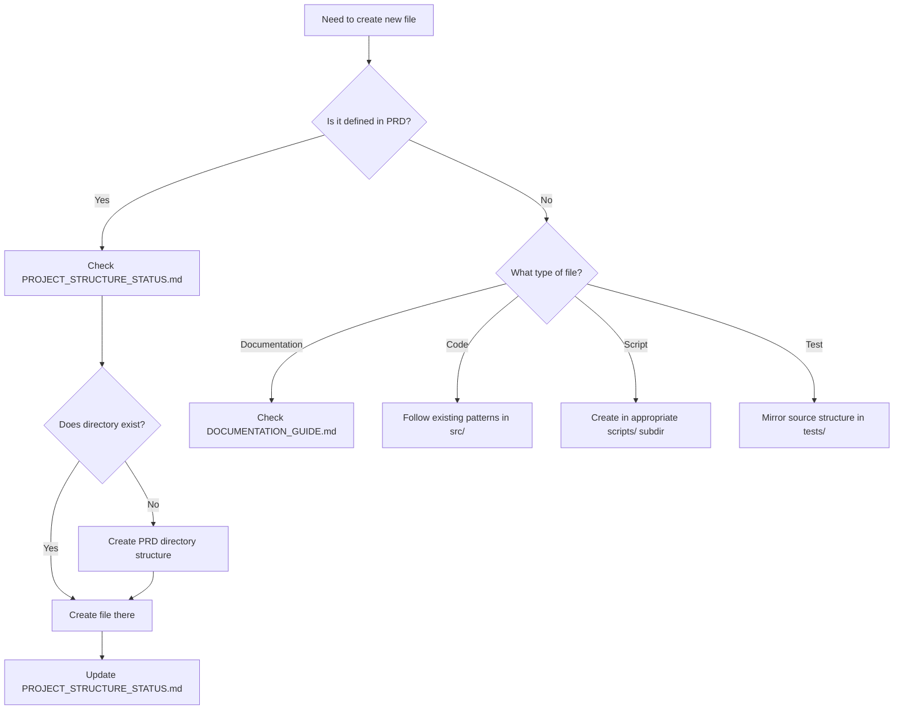

# 📁 Project Structure Guide

## Overview

This guide helps you make decisions about where to place new files and when to create PRD-defined directory structures.

## 🎯 Core Principles

1. **Follow PRD When Active**: If working on a feature with PRD-defined location, use it
2. **Progressive Creation**: Only create directories when you have files to put in them
3. **Document Deviations**: Always explain why you diverged from PRD
4. **Avoid Empty Structure**: Empty directories provide no value

## 🔍 Decision Framework

### When Creating a New File



## 📋 Quick Reference by File Type

### Code Files

| File Type | PRD Location | Current Practice |
|-----------|--------------|------------------|
| API endpoints | `src/api/routers/` | Not yet (Phase 2) |
| Core logic | `src/core/{feature}/` | ✅ Using |
| Services | `src/services/{service}/` | Not yet |
| Utilities | `src/utils/{category}/` | Not yet |
| Memory models | `src/core/memory/` | ✅ Using |
| Safety logic | `src/core/safety/` | ✅ Using |

### Scripts

| Script Type | PRD Location | When to Create |
|------------|--------------|----------------|
| Development aids | `scripts/development/` | When needed |
| Test runners | `scripts/testing/` | Phase 1 completion |
| Doc generators | `scripts/documentation/` | Phase 2 |
| DB management | `scripts/database/` | ✅ Already exists |
| Utilities | `scripts/utilities/` | As needed |

### Tests

| Test Type | PRD Location | Current Status |
|----------|--------------|----------------|
| Unit tests | `tests/unit/` | ✅ Active |
| Integration | `tests/integration/` | ✅ Active |
| E2E tests | `tests/e2e/` | Phase 2+ |
| Test fixtures | `tests/fixtures/` | When needed |

### Documentation

See DOCUMENTATION_GUIDE.md for detailed documentation placement.

## 🚦 When to Create PRD Structure

### ✅ Create Structure When:

1. **Starting Feature Work**: Beginning development that will use that structure
2. **Multiple Files**: You have 2+ files that belong in that directory
3. **Active Development**: The area is under active development
4. **Team Coordination**: Others need to know where to find/place files

### ❌ Don't Create Structure When:

1. **No Immediate Use**: No files to put there yet
2. **Future Planning**: It's for "someday" features
3. **Single File**: Only one file would go there
4. **Unclear Purpose**: You're not sure what would go there

## 📝 Deviation Documentation

When diverging from PRD structure:

### Required Documentation

1. **Where**: Document in PROJECT_STRUCTURE_STATUS.md
2. **What**: Clearly state the deviation
3. **Why**: Explain the reasoning
4. **When**: Note when to align with PRD

### Example Deviation Entry

```markdown
### Deviation: Custom migrations/ directory
- **PRD Location**: Not specified
- **Our Location**: `/migrations/`
- **Reason**: Industry standard for database versioning
- **Alignment**: No change needed - justified addition
```

## 🔄 Progressive Implementation Strategy

### Phase 1 (Current)
Focus on core safety and memory features:
- ✅ `src/core/` subdirectories as needed
- ✅ Basic `scripts/database/`
- 🔄 Add `scripts/development/` for key tools
- 🔄 Add `scripts/testing/` for test automation

### Phase 2
API and service layer:
- Add `src/api/` structure
- Add `src/services/` as needed
- Expand `scripts/documentation/`

### Phase 3
Integration features:
- Complete `src/services/`
- Add vault integration scripts
- Expand testing structure

### Phase 4
Polish and completion:
- Add `tests/e2e/`
- Complete all PRD structure
- Add deployment scripts

## 🎯 Best Practices

1. **Check Before Creating**: Always review PROJECT_STRUCTURE_STATUS.md
2. **Update After Creating**: Mark new structures as implemented
3. **Batch Related Items**: Create structure when you have multiple related files
4. **Document Decisions**: Explain why you put something somewhere
5. **Review Regularly**: During section analysis, review structure alignment

## 📊 Structure Health Metrics

Track these in section analyses:
- New directories created vs PRD alignment
- Deviations introduced and why
- Structure debt (what needs future alignment)
- Empty directories (should be removed)

---

*When in doubt, check PROJECT_STRUCTURE_STATUS.md and follow existing patterns.*