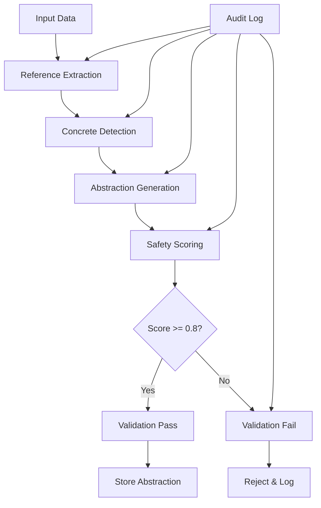

# 🛡️ Cognitive Coding Partner: Core Safety Principles

---
**Document**: Safety Principles and Guidelines  
**Version**: 1.1  
**Date**: 2025-01-19  
**Purpose**: Define fundamental safety principles that govern all CCP operations  
**Criticality**: MANDATORY - All components must adhere to these principles  
**Updated**: Added Law 6 - Document Reality, Not Aspirations

---

## 🎯 Safety Mission Statement

The Cognitive Coding Partner prioritizes safety through systematic abstraction of all temporal references, ensuring that historical data never leads to invalid operations in current contexts. Every component is built with safety validation from the ground up.

## 🔐 Fundamental Safety Laws

### Law 1: Abstract by Default
**Principle**: All concrete references must be abstracted before storage.

**Rationale**: Concrete references (file paths, IDs, URLs) become stale over time. Abstractions preserve intent while preventing invalid operations.

**Implementation**:
- Every memory storage operation MUST pass through abstraction pipeline
- Concrete references are extracted and stored separately from abstractions
- System operates on abstractions, not concrete values

### Law 2: Validate Continuously
**Principle**: Every operation includes safety validation at multiple layers.

**Rationale**: Defense in depth prevents unsafe data from propagating through the system.

**Validation Layers**:
1. **Input Validation**: Before processing any data
2. **Storage Validation**: Before persisting to database
3. **Retrieval Validation**: When accessing historical data
4. **Usage Validation**: Before applying historical patterns

### Law 3: Fail Safely
**Principle**: System rejects unsafe operations rather than attempting risky corrections.

**Rationale**: Better to refuse an operation than to corrupt data or cause unexpected behavior.

**Failure Modes**:
- Reject storage of memories with safety score < 0.8
- Block retrieval of invalidated references
- Prevent execution of outdated patterns
- Return clear error messages explaining safety violations

### Law 4: Warn Transparently
**Principle**: Users are informed when historical references don't match current state.

**Rationale**: Transparency builds trust and helps users understand system behavior.

**Warning Types**:
- **Temporal Mismatch**: Referenced entity has changed
- **Missing Reference**: Referenced entity no longer exists
- **Pattern Deviation**: Current context differs from historical pattern
- **Safety Threshold**: Operation approaching safety limits

### Law 5: Audit Everything
**Principle**: Complete audit trail of all safety decisions and validations.

**Rationale**: Accountability and debugging require comprehensive logging.

**Audit Requirements**:
- Log all abstraction operations
- Record validation decisions
- Track safety score calculations
- Monitor reference usage patterns

### Law 6: Document Reality, Not Aspirations
**Principle**: All documentation must reflect actual system state with appropriate context, not cherry-picked metrics or intended future state.

**Rationale**: Delusional documentation compounds technical debt, breaks trust, and leads to false confidence in system capabilities.

**Implementation**:

#### A. Feature Documentation
- Test status must be verified before documenting as "complete"
- Feature claims require working demonstrations
- Progress tracking based on passing tests, not written code
- "Implemented" means: coded + tested + integrated + documented

#### B. Metric Integrity
- **Context Required**: All metrics must include test conditions
- **Bad**: "Memory usage: 45MB ✅"  
- **Good**: "Memory usage: 45MB (database only, no API, no features loaded)"
- **Bad**: "90% test coverage"
- **Good**: "90% test coverage (10 of 11 abstraction tests passing, 157 other tests not running)"

#### C. Test Result Reality
- Test counts = passing tests only
- Non-running tests marked as "unverified" not "implemented"
- Coverage metrics include denominators (e.g., "10/167 tests passing")
- Performance claims require full feature load

#### D. Regular Reality Audits
- Weekly review: Do docs match reality?
- Remove or mark stale claims
- Update metrics with current context
- Flag aspirational content clearly

#### E. Prohibited Practices
- ❌ Claiming partial implementation as complete
- ❌ Extrapolating limited test results to full system
- ❌ Hiding critical context in footnotes
- ❌ Using future tense for current state ("will support")

#### F. Required Practices
- ✅ Mark work-in-progress clearly
- ✅ Include test environment in all metrics
- ✅ Date all performance claims
- ✅ Separate "tested" from "implemented"

## 📋 Safety Implementation Principles

### 1. Build Safety Into Foundation
- Safety is not a feature to add later
- Every component designed with safety constraints
- Database schema enforces safety rules
- APIs validate safety before processing

### 2. Pattern Over Implementation
- Store algorithmic patterns, not specific code
- Capture intent and approach, not concrete values
- Focus on reusable concepts
- Abstract implementation details

### 3. Temporal Awareness
- All data tagged with temporal metadata
- Degradation algorithms reduce relevance over time
- Recent patterns preferred over historical
- Time-based validation of references

### 4. Context Preservation
- Store complete context for proper abstraction
- Maintain relationships between abstractions
- Preserve semantic meaning
- Enable intelligent pattern matching

### 5. User Control
- Users can override safety warnings (with logging)
- Configurable safety thresholds
- Manual validation triggers
- Safety report generation

## 🚨 Critical Safety Rules

### Rule 1: No Concrete File Paths in Memory
❌ **Prohibited**: `/home/user/project/src/main.py`  
✅ **Required**: `<project_root>/src/main.py`

### Rule 2: No Hardcoded Identifiers
❌ **Prohibited**: `user_id = 12345`  
✅ **Required**: `user_id = <user_identifier>`

### Rule 3: No Environment-Specific References
❌ **Prohibited**: `docker.containers.get('app-prod-v1.2.3')`  
✅ **Required**: `docker.containers.get('<app_container>')`

### Rule 4: No Absolute URLs
❌ **Prohibited**: `https://api.production.example.com/v1/users`  
✅ **Required**: `<api_base_url>/users`

### Rule 5: No Temporary Values
❌ **Prohibited**: `token = 'eyJhbGciOiJIUzI1NiIs...'`  
✅ **Required**: `token = <auth_token>`

## 🔍 Safety Validation Pipeline



## 📊 Safety Metrics

### Minimum Thresholds
- **Abstraction Score**: ≥ 0.8 (mandatory)
- **Reference Coverage**: 100% abstracted
- **Validation Success**: > 99%
- **False Positive Rate**: < 1%

### Monitoring Requirements
- Real-time safety score tracking
- Abstraction quality metrics
- Validation failure analysis
- Reference usage patterns

## 🚫 Prohibited Patterns

### 1. Direct Reference Storage
```python
# PROHIBITED
memory.store({
    "code": "file = open('/home/user/data.txt')"
})
```

### 2. Skipping Validation
```python
# PROHIBITED
def store_memory(data):
    # Missing safety validation!
    db.insert(data)
```

### 3. Ignoring Safety Warnings
```python
# PROHIBITED
try:
    unsafe_operation()
except SafetyWarning:
    pass  # Never ignore safety warnings!
```

### 4. Hardcoding Thresholds
```python
# PROHIBITED
if score > 0.5:  # Hardcoded threshold
    accept()
```

### 5. Bypassing Abstraction
```python
# PROHIBITED
memory.store(raw_data, skip_abstraction=True)
```

## ✅ Required Patterns

### 1. Always Abstract References
```python
# REQUIRED
abstracted_data = abstraction_engine.process(raw_data)
validated_data = safety_validator.validate(abstracted_data)
memory.store(validated_data)
```

### 2. Comprehensive Validation
```python
# REQUIRED
def store_memory(data):
    validation_result = safety_validator.validate(data)
    if validation_result.is_safe:
        db.insert(validation_result.abstracted_data)
    else:
        raise SafetyValidationError(validation_result.errors)
```

### 3. Handle Safety Warnings
```python
# REQUIRED
try:
    result = perform_operation()
except SafetyWarning as e:
    logger.warning(f"Safety warning: {e}")
    user_notifier.warn(e)
    audit_logger.log_safety_event(e)
```

### 4. Use Configuration
```python
# REQUIRED
safety_threshold = config.get('safety.minimum_score', 0.8)
if score >= safety_threshold:
    accept()
```

### 5. Always Use Pipeline
```python
# REQUIRED
pipeline = SafetyPipeline()
safe_data = pipeline.process(raw_data)  # Includes all safety steps
memory.store(safe_data)
```

## 🔄 Safety Review Process

### 1. Pre-Implementation Review
- Review design for safety compliance
- Identify potential safety risks
- Plan mitigation strategies
- Document safety decisions

### 2. Implementation Validation
- Code review focuses on safety
- Automated safety tests required
- Manual safety testing for edge cases
- Performance impact assessment

### 3. Post-Implementation Audit
- Monitor safety metrics
- Analyze validation failures
- Update abstraction patterns
- Refine safety thresholds

## 📝 Safety Checklist

Before any code merge, verify:

- [ ] All concrete references abstracted
- [ ] Safety validation implemented
- [ ] Minimum safety score enforced
- [ ] Audit logging in place
- [ ] Error handling implemented
- [ ] User warnings configured
- [ ] Tests include safety cases
- [ ] Documentation updated
- [ ] Metrics collection active
- [ ] Review process followed

## 🎯 Conclusion

Safety is not optional in the Cognitive Coding Partner. These principles ensure that the system remains reliable, predictable, and trustworthy over time. Every developer must understand and follow these principles to maintain system integrity.

Remember: **It's always better to be safe than sorry.** When in doubt, abstract more, validate more, and warn more.

---
*This document is mandatory reading for all CCP developers. Updates require security team approval.*