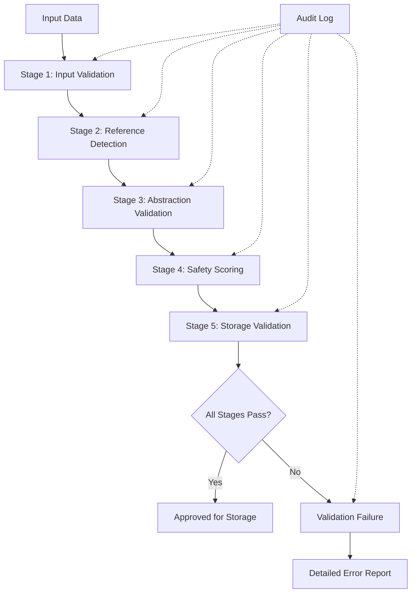

# 🔍 Cognitive Coding Partner: Reference Validation Rules

---
**Document**: Safety Validation Rules and Procedures  
**Version**: 1.0  
**Date**: 2025-01-13  
**Purpose**: Define validation rules for ensuring safe reference abstraction  
**Enforcement**: Automated validation at all system boundaries  

---

## 📋 Validation Overview

This document defines the validation rules that ensure all references are properly abstracted before storage and safe for retrieval. Validation occurs at multiple stages throughout the system lifecycle.

## 🎯 Validation Objectives

1. **Prevent Concrete Reference Storage**: No hardcoded values in memory
2. **Ensure Abstraction Quality**: All abstractions meet minimum standards
3. **Maintain Temporal Safety**: Historical references remain valid
4. **Provide Clear Feedback**: Users understand validation failures
5. **Enable Auditability**: Complete validation trail

---

## 🔄 Validation Pipeline



---

## 📊 Stage 1: Input Validation

### Purpose
Ensure input data is well-formed and processable.

### Rules

#### Rule 1.1: Structure Validation
```python
def validate_input_structure(data: Dict) -> ValidationResult:
    required_fields = ['prompt', 'code', 'language']
    
    # Check required fields exist
    missing = [f for f in required_fields if f not in data]
    if missing:
        return ValidationResult(
            valid=False,
            errors=[f"Missing required fields: {missing}"]
        )
    
    # Validate field types
    if not isinstance(data['prompt'], str):
        return ValidationResult(
            valid=False,
            errors=["'prompt' must be a string"]
        )
    
    return ValidationResult(valid=True)
```

#### Rule 1.2: Size Limits
- **Prompt**: Maximum 10,000 characters
- **Code**: Maximum 100,000 characters
- **Metadata**: Maximum 1MB JSON

#### Rule 1.3: Character Encoding
- Must be valid UTF-8
- No null bytes
- No control characters (except newlines, tabs)

### Validation Errors
```python
class InputValidationError(ValidationError):
    ERROR_CODES = {
        'E1001': 'Missing required field',
        'E1002': 'Invalid field type',
        'E1003': 'Size limit exceeded',
        'E1004': 'Invalid character encoding',
        'E1005': 'Malformed JSON structure',
    }
```

---

## 🔍 Stage 2: Reference Detection

### Purpose
Identify all concrete references that require abstraction.

### Detection Rules

#### Rule 2.1: File Path Detection
```python
FILE_PATH_RULES = {
    'absolute_unix': r'^/[a-zA-Z0-9/_.\-]+',
    'absolute_windows': r'^[A-Z]:\\',
    'home_directory': r'^~/',
    'relative_path': r'\.{1,2}/[a-zA-Z0-9/_.\-]+',
}

def detect_file_paths(content: str) -> List[Reference]:
    references = []
    for rule_name, pattern in FILE_PATH_RULES.items():
        matches = re.finditer(pattern, content)
        for match in matches:
            references.append(Reference(
                type='file_path',
                value=match.group(),
                position=match.span(),
                rule=rule_name
            ))
    return references
```

#### Rule 2.2: Identifier Detection
```python
IDENTIFIER_RULES = {
    'numeric_id': r'\b(?:id|ID)\s*[=:]\s*\d+',
    'uuid': r'[0-9a-f]{8}-[0-9a-f]{4}-[0-9a-f]{4}-[0-9a-f]{4}-[0-9a-f]{12}',
    'api_key': r'(?:api_key|API_KEY)\s*[=:]\s*["\'][\w\-]+["\']',
    'token': r'(?:token|Token|TOKEN)\s*[=:]\s*["\'][\w\-\.]+["\']',
}
```

#### Rule 2.3: Network Reference Detection
```python
NETWORK_RULES = {
    'url': r'https?://[^\s<>"{}|\\^`\[\]]+',
    'ip_address': r'\b(?:\d{1,3}\.){3}\d{1,3}\b',
    'port': r':\d{1,5}\b',
    'email': r'\b[A-Za-z0-9._%+-]+@[A-Za-z0-9.-]+\.[A-Z|a-z]{2,}\b',
}
```

### Detection Validation
Each detected reference must have:
- Type classification
- Exact position in content
- Confidence score (0.0 - 1.0)
- Suggested abstraction

---

## ✅ Stage 3: Abstraction Validation

### Purpose
Ensure abstractions are appropriate and preserve meaning.

### Abstraction Rules

#### Rule 3.1: Semantic Preservation
```python
def validate_semantic_preservation(original: str, abstracted: str) -> bool:
    """Ensure abstraction preserves semantic meaning"""
    
    # Extract semantic components
    original_parts = extract_semantic_parts(original)
    abstracted_parts = extract_semantic_parts(abstracted)
    
    # Verify structure preserved
    if len(original_parts) != len(abstracted_parts):
        return False
    
    # Verify relationships preserved
    for i, part in enumerate(abstracted_parts):
        if is_placeholder(part):
            # Placeholder must represent same type
            if not compatible_types(original_parts[i], part):
                return False
    
    return True
```

#### Rule 3.2: Abstraction Completeness
```python
def validate_completeness(content: str, abstractions: List[Abstraction]) -> ValidationResult:
    """Ensure all concrete references are abstracted"""
    
    # Re-detect references in abstracted content
    remaining_refs = detect_all_references(content)
    
    if remaining_refs:
        return ValidationResult(
            valid=False,
            errors=[f"Unabstracted references found: {remaining_refs}"]
        )
    
    return ValidationResult(valid=True)
```

#### Rule 3.3: Consistency Validation
```python
def validate_consistency(abstractions: List[Abstraction]) -> ValidationResult:
    """Ensure consistent abstraction of similar references"""
    
    abstraction_map = {}
    
    for abstr in abstractions:
        key = (abstr.reference_type, normalize(abstr.original))
        
        if key in abstraction_map:
            if abstraction_map[key] != abstr.abstracted:
                return ValidationResult(
                    valid=False,
                    errors=[f"Inconsistent abstraction: {abstr.original}"]
                )
        else:
            abstraction_map[key] = abstr.abstracted
    
    return ValidationResult(valid=True)
```

### Abstraction Quality Metrics
- **Coverage**: % of references abstracted
- **Accuracy**: Correct abstraction type selection
- **Consistency**: Same input → same output
- **Reversibility**: Can determine original type

---

## 📏 Stage 4: Safety Scoring

### Purpose
Calculate safety score based on abstraction quality.

### Scoring Algorithm
```python
def calculate_safety_score(validation_data: ValidationData) -> float:
    """Calculate overall safety score (0.0 - 1.0)"""
    
    weights = {
        'abstraction_coverage': 0.3,
        'semantic_preservation': 0.25,
        'consistency': 0.2,
        'pattern_quality': 0.15,
        'validation_passes': 0.1,
    }
    
    scores = {
        'abstraction_coverage': validation_data.coverage_score,
        'semantic_preservation': validation_data.semantic_score,
        'consistency': validation_data.consistency_score,
        'pattern_quality': validation_data.pattern_score,
        'validation_passes': validation_data.validation_score,
    }
    
    # Weighted average
    total_score = sum(weights[k] * scores[k] for k in weights)
    
    # Apply penalties
    if validation_data.has_critical_errors:
        total_score *= 0.5
    
    return min(max(total_score, 0.0), 1.0)
```

### Score Thresholds
- **≥ 0.8**: Safe for storage (required minimum)
- **0.6 - 0.79**: Requires manual review
- **< 0.6**: Rejected automatically

### Score Components

#### Abstraction Coverage (30%)
```python
coverage_score = abstracted_references / total_references
```

#### Semantic Preservation (25%)
```python
semantic_score = preserved_meanings / total_abstractions
```

#### Consistency Score (20%)
```python
consistency_score = consistent_abstractions / total_similar_refs
```

#### Pattern Quality (15%)
```python
pattern_score = high_confidence_matches / total_patterns_used
```

#### Validation Passes (10%)
```python
validation_score = passed_validations / total_validations
```

---

## 💾 Stage 5: Storage Validation

### Purpose
Final validation before persisting to database.

### Storage Rules

#### Rule 5.1: Mandatory Fields
```python
MANDATORY_FIELDS = {
    'abstracted_prompt': str,
    'abstracted_code': str,
    'abstraction_mappings': dict,
    'safety_score': float,
    'validation_timestamp': datetime,
}

def validate_storage_ready(data: Dict) -> ValidationResult:
    errors = []
    
    for field, expected_type in MANDATORY_FIELDS.items():
        if field not in data:
            errors.append(f"Missing mandatory field: {field}")
        elif not isinstance(data[field], expected_type):
            errors.append(f"Invalid type for {field}")
    
    if data.get('safety_score', 0) < 0.8:
        errors.append("Safety score below minimum threshold")
    
    return ValidationResult(valid=len(errors) == 0, errors=errors)
```

#### Rule 5.2: Reference Mapping Validation
```python
def validate_reference_mappings(mappings: Dict) -> ValidationResult:
    """Ensure all mappings are properly structured"""
    
    for original, abstracted in mappings.items():
        # Original must be concrete
        if is_placeholder(original):
            return ValidationResult(
                valid=False,
                errors=[f"Invalid mapping: original is placeholder: {original}"]
            )
        
        # Abstracted must contain placeholder
        if not contains_placeholder(abstracted):
            return ValidationResult(
                valid=False,
                errors=[f"Invalid mapping: no placeholder in: {abstracted}"]
            )
    
    return ValidationResult(valid=True)
```

#### Rule 5.3: Temporal Metadata
```python
def validate_temporal_metadata(data: Dict) -> ValidationResult:
    """Ensure temporal tracking information present"""
    
    required_temporal = [
        'created_at',
        'validation_timestamp',
        'degradation_config',
    ]
    
    missing = [f for f in required_temporal if f not in data]
    if missing:
        return ValidationResult(
            valid=False,
            errors=[f"Missing temporal metadata: {missing}"]
        )
    
    return ValidationResult(valid=True)
```

---

## 🔄 Retrieval Validation

### Purpose
Validate references when retrieving from storage.

### Retrieval Rules

#### Rule R.1: Temporal Validation
```python
def validate_temporal_relevance(memory: Memory) -> ValidationResult:
    """Check if memory is still temporally relevant"""
    
    age_days = (datetime.now() - memory.created_at).days
    
    if age_days > 365:
        return ValidationResult(
            valid=True,
            warnings=["Memory over 1 year old - verify relevance"]
        )
    
    if memory.degradation_weight < 0.1:
        return ValidationResult(
            valid=True,
            warnings=["Low relevance weight - consider context"]
        )
    
    return ValidationResult(valid=True)
```

#### Rule R.2: Reference Freshness
```python
def validate_reference_freshness(memory: Memory, context: Context) -> ValidationResult:
    """Validate abstracted references against current context"""
    
    stale_refs = []
    
    for mapping in memory.abstraction_mappings:
        if not context.can_resolve(mapping.abstracted):
            stale_refs.append(mapping)
    
    if stale_refs:
        return ValidationResult(
            valid=True,
            warnings=[f"Potentially stale references: {len(stale_refs)}"],
            metadata={'stale_refs': stale_refs}
        )
    
    return ValidationResult(valid=True)
```

---

## 🚨 Validation Error Handling

### Error Categories

#### Critical Errors (Block Operation)
- No abstraction performed
- Safety score < 0.8
- Missing mandatory fields
- Malformed data structure

#### Warnings (Allow with Caution)
- Old memories (> 6 months)
- Low relevance weight
- Partial abstraction coverage
- Unknown reference types

### Error Response Format
```python
@dataclass
class ValidationError:
    code: str
    message: str
    severity: Literal['critical', 'error', 'warning', 'info']
    context: Dict[str, Any]
    suggestion: Optional[str]
    
    def to_dict(self) -> Dict:
        return {
            'code': self.code,
            'message': self.message,
            'severity': self.severity,
            'context': self.context,
            'suggestion': self.suggestion,
            'timestamp': datetime.now().isoformat()
        }
```

### User-Friendly Error Messages
```python
ERROR_MESSAGES = {
    'E001': {
        'technical': 'Concrete file path detected without abstraction',
        'user': 'This memory contains specific file paths that may not work in the future. Please use relative paths instead.',
        'suggestion': 'Replace "/home/user/project/file.py" with "<project_root>/file.py"'
    },
    'E002': {
        'technical': 'Safety score below threshold: {score}',
        'user': 'This memory doesn\'t meet our safety standards. Too many specific references were found.',
        'suggestion': 'Review and abstract concrete values like IDs, paths, and URLs'
    },
}
```

---

## 📊 Validation Metrics

### Key Performance Indicators
1. **Validation Success Rate**: > 95%
2. **False Positive Rate**: < 1%
3. **Average Validation Time**: < 100ms
4. **Safety Score Distribution**: Mean > 0.9

### Monitoring Dashboard
```python
class ValidationMetrics:
    def __init__(self):
        self.total_validations = 0
        self.successful_validations = 0
        self.failed_validations = 0
        self.safety_scores = []
        self.validation_times = []
        self.error_distribution = Counter()
    
    def record_validation(self, result: ValidationResult, duration_ms: float):
        self.total_validations += 1
        
        if result.valid:
            self.successful_validations += 1
        else:
            self.failed_validations += 1
            for error in result.errors:
                self.error_distribution[error.code] += 1
        
        if result.safety_score:
            self.safety_scores.append(result.safety_score)
        
        self.validation_times.append(duration_ms)
    
    @property
    def success_rate(self) -> float:
        return self.successful_validations / self.total_validations
    
    @property
    def average_safety_score(self) -> float:
        return sum(self.safety_scores) / len(self.safety_scores)
    
    @property
    def p95_validation_time(self) -> float:
        return sorted(self.validation_times)[int(len(self.validation_times) * 0.95)]
```

---

## 🧪 Validation Testing

### Test Categories

#### 1. Positive Tests
```python
def test_valid_abstraction():
    """Test successful validation of properly abstracted content"""
    
    input_data = {
        'prompt': 'Read the configuration file',
        'code': 'config = read_file("<project_root>/config.yaml")',
        'language': 'python',
        'abstracted_prompt': 'Read the configuration file',
        'abstracted_code': 'config = read_file("<project_root>/config.yaml")',
        'abstraction_mappings': {},
        'safety_score': 0.95
    }
    
    result = validator.validate(input_data)
    assert result.valid
    assert result.safety_score >= 0.8
```

#### 2. Negative Tests  
```python
def test_concrete_reference_rejection():
    """Test rejection of concrete references"""
    
    input_data = {
        'prompt': 'Read the file',
        'code': 'data = read_file("/home/user/data.txt")',
        'language': 'python',
    }
    
    result = validator.validate(input_data)
    assert not result.valid
    assert 'E001' in [e.code for e in result.errors]
```

#### 3. Edge Cases
```python
def test_mixed_references():
    """Test partial abstraction detection"""
    
    input_data = {
        'code': '''
        file1 = "<project_root>/data.txt"  # Abstracted
        file2 = "/home/user/other.txt"     # Concrete!
        '''
    }
    
    result = validator.validate(input_data)
    assert not result.valid
    assert result.coverage_score < 1.0
```

---

## 🔐 Security Considerations

### Validation Bypass Prevention
1. No validation flags in production
2. All validation stages mandatory
3. Cryptographic signatures on validated data
4. Audit log tampering detection

### Validation Performance
1. Cache validation results (5 minute TTL)
2. Parallel validation stages where possible
3. Early termination on critical errors
4. Async validation for large batches

---

## 📋 Validation Checklist

Before deployment, ensure:

- [ ] All validation stages implemented
- [ ] Minimum safety score enforced (0.8)
- [ ] Error messages user-friendly
- [ ] Audit logging comprehensive
- [ ] Performance metrics acceptable
- [ ] Test coverage > 95%
- [ ] Security review completed
- [ ] Documentation updated
- [ ] Monitoring dashboards configured
- [ ] Incident response plan ready

---

*This document defines the mandatory validation rules for the Cognitive Coding Partner. Any changes require security team approval and comprehensive testing.*