# 🕸️ CoachNTT.ai Project Knowledge Graph

## 📋 Overview

This document provides a comprehensive visual representation of the CoachNTT.ai system architecture, component relationships, and data flow patterns. The knowledge graph reveals the interconnected nature of the cognitive coding partner system and helps understand how different components work together to provide safety-first AI assistance.

## 🏗️ System Architecture Graph

### High-Level System Components

## 🧠 Memory System Architecture

### Memory Processing Pipeline

## 🕸️ Knowledge Graph System

### Graph Building and Query Flow

## 🔗 Integration System Architecture

### Vault Synchronization Flow

```mermaid
graph TD
    %% Sync Triggers
    USER_TRIGGER[User Command<br/>sync vault] --> SYNC_ENGINE[Vault Sync Engine]
    AUTOMATED[Automated Sync<br/>Schedule/Hooks] --> SYNC_ENGINE
    API_TRIGGER[API Request<br/>Integration Endpoint] --> SYNC_ENGINE
    
    %% Direction Selection
    SYNC_ENGINE --> DIRECTION{Sync Direction}
    DIRECTION -->|to-vault| TO_VAULT[Memory → Vault]
    DIRECTION -->|from-vault| FROM_VAULT[Vault → Memory]
    DIRECTION -->|bidirectional| BOTH[Bidirectional Sync]
    
    %% Memory to Vault Flow
    TO_VAULT --> MEMORY_FETCH[Fetch Memories]
    MEMORY_FETCH --> TEMPLATE_SELECT[Template Selection]
    TEMPLATE_SELECT --> MARKDOWN_CONVERT[Markdown Conversion]
    MARKDOWN_CONVERT --> FRONTMATTER_GEN[Frontmatter Generation]
    FRONTMATTER_GEN --> VAULT_WRITE[Write to Vault]
    
    %% Vault to Memory Flow
    FROM_VAULT --> VAULT_SCAN[Scan Vault Files]
    VAULT_SCAN --> MARKDOWN_PARSE[Parse Markdown]
    MARKDOWN_PARSE --> FRONTMATTER_EXTRACT[Extract Frontmatter]
    FRONTMATTER_EXTRACT --> CONTENT_EXTRACT[Extract Content]
    CONTENT_EXTRACT --> MEMORY_CREATE[Create Memory]
    
    %% Bidirectional Flow
    BOTH --> CONFLICT_DETECT[Conflict Detection]
    CONFLICT_DETECT --> CONFLICT_RESOLVE[Conflict Resolution]
    CONFLICT_RESOLVE --> TO_VAULT
    CONFLICT_RESOLVE --> FROM_VAULT
    
    %% Safety and Validation
    MARKDOWN_CONVERT --> SAFETY_CHECK[Safety Validation]
    MEMORY_CREATE --> SAFETY_CHECK
    SAFETY_CHECK --> ABSTRACTION_APPLY[Apply Abstraction]
    
    %% Template Processing
    TEMPLATE_SELECT --> TEMPLATE_PROC[Template Processor]
    TEMPLATE_PROC --> VAR_SUBSTITUTE[Variable Substitution]
    VAR_SUBSTITUTE --> TEMPLATE_VALIDATE[Template Validation]
    
    %% Output and Reporting
    VAULT_WRITE --> SYNC_REPORT[Sync Report]
    MEMORY_CREATE --> SYNC_REPORT
    SYNC_REPORT --> STATUS_UPDATE[Status Update]
    STATUS_UPDATE --> USER_FEEDBACK[User Feedback]
    
    %% Styling
    classDef trigger fill:#e3f2fd
    classDef processing fill:#e8f5e8
    classDef safety fill:#ffebee
    classDef output fill:#f3e5f5
    
    class USER_TRIGGER,AUTOMATED,API_TRIGGER trigger
    class SYNC_ENGINE,MEMORY_FETCH,TEMPLATE_SELECT,MARKDOWN_CONVERT,VAULT_SCAN,CONFLICT_DETECT processing
    class SAFETY_CHECK,ABSTRACTION_APPLY,TEMPLATE_VALIDATE safety
    class SYNC_REPORT,STATUS_UPDATE,USER_FEEDBACK output
```

## 🏛️ API Architecture

### Request Processing Flow

## 🛡️ Safety Framework Architecture

### Safety Validation Pipeline

```mermaid
graph TD
    %% Input Content
    CONTENT_INPUT[Content Input<br/>Any Source] --> CONTENT_SCAN[Content Scanning]
    
    %% Initial Validation
    CONTENT_SCAN --> STRUCTURE_VAL[Structure Validation]
    STRUCTURE_VAL --> LENGTH_CHECK[Length Validation]
    LENGTH_CHECK --> ENCODING_CHECK[Encoding Validation]
    
    %% Reference Detection
    ENCODING_CHECK --> REF_DETECTOR[Reference Detector]
    REF_DETECTOR --> PATTERN_MATCH[Pattern Matching]
    PATTERN_MATCH --> CONTEXT_ANALYSIS[Context Analysis]
    
    %% Abstraction Process
    CONTEXT_ANALYSIS --> ABSTRACTION_ENGINE[Abstraction Engine]
    ABSTRACTION_ENGINE --> REF_EXTRACTOR[Reference Extractor]
    REF_EXTRACTOR --> PATTERN_GENERATOR[Pattern Generator]
    PATTERN_GENERATOR --> ABSTRACTION_RULES[Abstraction Rules]
    
    %% Quality Assessment
    ABSTRACTION_RULES --> QUALITY_SCORER[Quality Scorer]
    QUALITY_SCORER --> SAFETY_METRICS[Safety Metrics]
    SAFETY_METRICS --> SCORE_CALC[Score Calculation]
    
    %% Validation Gates
    SCORE_CALC --> SAFETY_GATE{Safety Score ≥ 0.8?}
    SAFETY_GATE -->|Yes| TEMPORAL_VAL[Temporal Validation]
    SAFETY_GATE -->|No| QUARANTINE[Quarantine Content]
    
    %% Temporal Processing
    TEMPORAL_VAL --> CONSISTENCY_CHECK[Consistency Check]
    CONSISTENCY_CHECK --> RELATIONSHIP_VAL[Relationship Validation]
    RELATIONSHIP_VAL --> FINAL_VALIDATION[Final Validation]
    
    %% Output Processing
    FINAL_VALIDATION --> SAFE_STORAGE[Safe Storage]
    QUARANTINE --> MANUAL_REVIEW[Manual Review Queue]
    MANUAL_REVIEW --> CORRECTIVE_ACTION[Corrective Action]
    
    %% Monitoring and Metrics
    SAFETY_METRICS --> METRICS_COLLECTOR[Metrics Collector]
    METRICS_COLLECTOR --> ALERT_SYSTEM[Alert System]
    ALERT_SYSTEM --> NOTIFICATION[Safety Notifications]
    
    %% Continuous Improvement
    SAFE_STORAGE --> FEEDBACK_LOOP[Feedback Loop]
    CORRECTIVE_ACTION --> RULE_UPDATES[Rule Updates]
    RULE_UPDATES --> ABSTRACTION_RULES
    
    %% Database Enforcement
    SAFE_STORAGE --> DB_TRIGGERS[Database Triggers]
    DB_TRIGGERS --> ROW_LEVEL_SECURITY[Row Level Security]
    ROW_LEVEL_SECURITY --> AUDIT_LOGGING[Audit Logging]
    
    %% Styling
    classDef input fill:#e3f2fd
    classDef validation fill:#ffebee
    classDef processing fill:#e8f5e8
    classDef storage fill:#fff3e0
    classDef monitoring fill:#f3e5f5
    
    class CONTENT_INPUT,CONTENT_SCAN input
    class STRUCTURE_VAL,LENGTH_CHECK,ENCODING_CHECK,REF_DETECTOR,SAFETY_GATE validation
    class ABSTRACTION_ENGINE,REF_EXTRACTOR,PATTERN_GENERATOR,QUALITY_SCORER processing
    class SAFE_STORAGE,DB_TRIGGERS,ROW_LEVEL_SECURITY storage
    class METRICS_COLLECTOR,ALERT_SYSTEM,FEEDBACK_LOOP monitoring
```

## 🔄 CLI Command Architecture

### CLI Command Flow and Structure

## 📊 Component Relationship Matrix

### System Dependencies and Interactions

| Component | Depends On | Provides To | Safety Level | Performance Impact |
|-----------|------------|-------------|--------------|-------------------|
| **CLI Interface** | API Server, Config | User Commands | High | Low |
| **REST API** | Database, Safety Framework | CLI, Web Interface | Critical | Medium |
| **Memory Repository** | Database, Validation | Memory Service | Critical | High |
| **Knowledge Graph** | Memory Repository, Embeddings | Graph Service | High | Medium |
| **Safety Framework** | Abstraction Engine, Metrics | All Components | Critical | Low |
| **Embedding Service** | Cache, Models | Memory/Graph Systems | Medium | High |
| **Vault Sync** | Template Processor, Safety | Integration Service | High | Medium |
| **WebSocket Server** | Authentication, Channels | Real-time Updates | Medium | Low |
| **Background Tasks** | Queue System, Services | Async Processing | Medium | Variable |

### Data Flow Paths

## 🚀 Performance Characteristics

### System Performance Profile

| Component | Response Time | Throughput | Resource Usage | Scalability |
|-----------|---------------|------------|----------------|-------------|
| **Memory CRUD** | <500ms | 100 ops/sec | Medium CPU | Horizontal |
| **Graph Building** | <1s (100 nodes) | 10 graphs/min | High CPU/Memory | Vertical |
| **Graph Queries** | <100ms | 1000 queries/sec | Low CPU | Horizontal |
| **Embedding Generation** | <200ms (batch) | 500 items/min | High CPU | Horizontal |
| **Safety Validation** | <1ms | 10000 checks/sec | Low CPU | Horizontal |
| **Vault Sync** | <2s | 50 files/min | Medium I/O | I/O Bound |
| **API Responses** | <200ms avg | 1000 req/sec | Low CPU | Horizontal |
| **WebSocket** | <50ms latency | 1000 connections | Low CPU | Connection Pool |

### Optimization Opportunities

## 🔮 Future Architecture Evolution

### Planned Enhancements

---

**Knowledge Graph Complete!** 🕸️

This comprehensive visualization reveals the intricate relationships and data flows within the CoachNTT.ai system, helping you understand how each component contributes to the overall cognitive coding assistance experience.